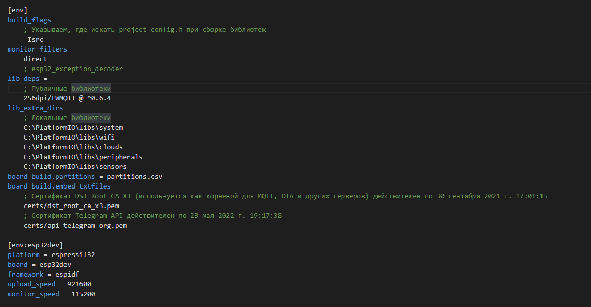

## PlatformIO_Study - переход с IDE Arduino на PlatformIO

### [Переползаем с Arduino IDE на VSCode + PlatformIO](https://kotyara12.ru/iot/crawl-to-pio/)

Устанавливаем плагин ***C++ IntelliSense***. В принципе этот шаг можно пропустить, PIO сам установит его в процессе, но я предпочитаю сделать это явно. 

> Следует иметь в виду, что установка плагинов в интерфейсе VSCode происходит вроде-бы мгновенно, а не деле вся работа производится в фоне. Не стоит сразу приступать к следующему шагу, следует дождаться соответствующего уведомления. Ну или просто немного подождать.

#### Настройка файла конфигурации проекта. 

Называется он “platformio.ini“. Именно по нем VSCode узнает, что это проект PlatformIO. У ***kotyara12.ru*** он может выглядеть так:



- Весь файл разделен на секции. 

- Секция [env] (без суффиксов) отвечает за глобальные настройки для всех плат.

- Секция [env:плата] отвечает за настройки для конкретной платы. 

> И таки да, один и тот же проект можно скомпилировать для самых разных плат, просто указав дополнительные секции.

***[Подробное описание всех параметров в документации](https://docs.platformio.org/en/latest/projectconf/index.html)***

- Первая опция build_flags указывает компилятору где искать исходники проекта. Дело в том, что все мои библиотеки находятся в каталоге, отличном от каталога проекта. А в каталоге проекта лежит очень важный файл – “project_config.h“, в нем собраны все настройки проекта. Который используется в том числе и самими библиотеками. Если не указать, где его искать, библиотеки не будут скомпилированы. Впрочем, Вы можете использовать другой подход, и Вам этот параметр не понадобится.

- Далее monitor_filters – опции монитора COM-порта. У меня включен прямой вывод, необходимый для вывода логов в цвете. На Windows 7 включать бесполезно, все равно не заработает. Кроме того, в программе для ESP32 должна быть включена соответствующая опция. Есть достаточно много параметров монитора, подробнее смотрите в документации.

- Далее lib_deps – зависимости от публичных библиотек. Если библиотека не установлена в PIO, то VSCode сам ее найдет и установит перед первым использованием. Удобно.

- Затем lib_extra_dirs – здесь я указываю папки с локальными библиотеками. В данном конкретном случае это мои библиотеки, но можно туда поместить и другие. Не нужно указывать пути к каждой отдельной библиотеке, но если библиотеки сгруппированы в подпапки (как у меня), то придется указать пути ко всем расположениям.

- board_build.partitions указывает на файл с разметкой flash-памяти ESP-хи. Это отдельный большой разговор, я не буду останавливаться на нем в рамках данной статьи. По умолчанию нафиг не нужен.

- board_build.embed_txtfiles указывает на дополнительные файлы, которые следует подключить к проекту. В данном случае это PEM-файлы с сертификатами для TLS-соединений. Но этого мало! Для ESP-IDF придется дополнительно прописать эти же файлы в другом файле конфигурации CMakeLists.txt:

```
# This file was automatically generated for projects
# without default 'CMakeLists.txt' file.

FILE(GLOB_RECURSE app_sources ${CMAKE_SOURCE_DIR}/src/*.*)
idf_component_register(SRCS ${app_sources})

target_add_binary_data(${COMPONENT_TARGET} ${CMAKE_SOURCE_DIR}/certs/dst_root_ca_x3.pem TEXT)
target_add_binary_data(${COMPONENT_TARGET} ${CMAKE_SOURCE_DIR}/certs/<span class="tooltipsall tooltipsincontent classtoolTips3" data-hasqtip="0">API</span>_telegram_org.pem TEXT)
```

- Ну и наконец секция [env:esp32dev] определяет настройки сборки проекта для конкретной платы – тип платы, платформу, фреймфорк, скорость монитора и заливки bin-файла на плату. 

Как ни странно, скорость upload выше скорости монитора, так как скорость передачи в порт определяется самой платой. Допустимые варианты: 300, 600, 1200, 2400, 4800, 9600, 19200, 38400, 57600, 74880, 115200, 230400, 256000, 460800, 921600, 1843200, 3686400. Можете поэкспериментировать. Опытным путем установлено, что выше 921600 ставить смысла не имеет.


### Установка и секреты работы в популярном плагине PlatfromIO для Visual Studio Code

📝 12.03.2024 🔹 [Подключение библиотек к проекту PlatformIO](https://kotyara12.ru/iot/pio-libs/)

📝 10.12.2023 🔹 [Как и на чём программировать ESP32 и ESP8266](https://kotyara12.ru/iot/esp_start/)

📝 11.10.2023 🔹 [Управление версиями фреймворков Arduino32 и ESP-IDF в проектах PlatformIO](https://kotyara12.ru/iot/pio_versions_control/)

📝 13.04.2023 🔹 [Пакетная компиляция проектов PlatformIO](https://kotyara12.ru/iot/batch-pio-compile/)

📝 24.11.2022 🔹 [Создание PlatformIO / ESP-IDF проекта и настройка platformio.ini](https://kotyara12.ru/iot/pio_first_project/)

📝 17.11.2022 🔹 [Установка PlatformIO на компьютеры с ОС Windows](https://kotyara12.ru/iot/pio_install/)

📝 21.03.2022 🔹 [Расшифровка адресов ESP32 backtrace в PlatformIO](https://kotyara12.ru/iot/platformio-addr2name/)

📝 21.04.2021 🔹 [Переползаем с Arduino IDE на VSCode + PlatformIO](https://kotyara12.ru/iot/crawl-to-pio/)


